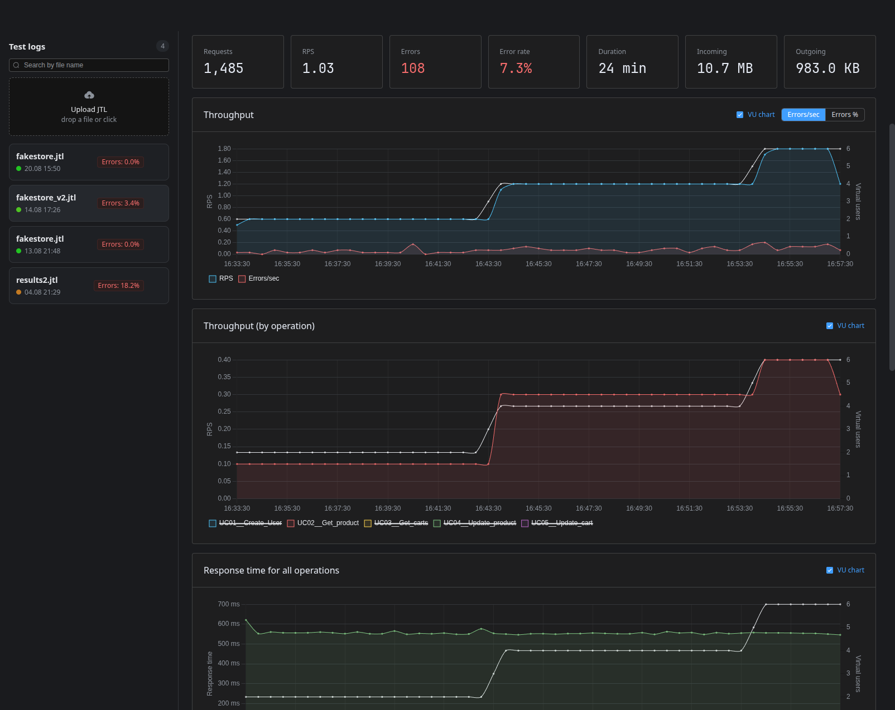
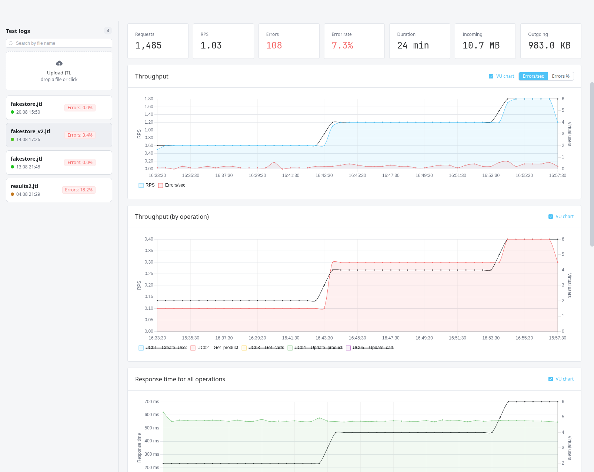
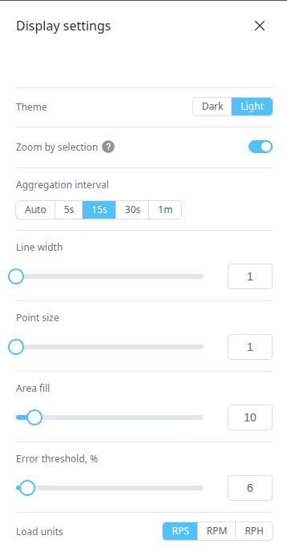
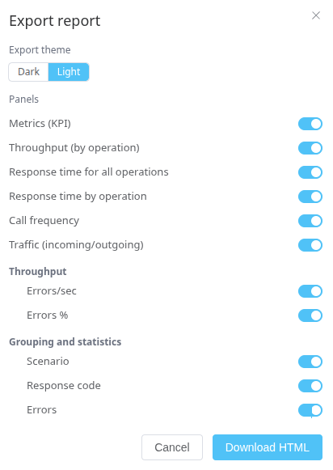

# jtl-viewer

[English](README.md) | [Русский](README.ru.md)

Web app to upload JMeter JTL files and visualize load test results: response times, throughput, errors, traffic — with HTML report export and a multilingual (RU/EN) interface.

## Demo

<video src="https://github.com/user-attachments/assets/678af7a8-b066-4d9d-96dc-6d6970d55f15" controls width="100%"></video>

<p>
  
  
</p>

<p>
  
  
</p>

## Features

- Upload JTL via drag & drop — auto-detects separator (tab/comma), batch DB writes
- KPI cards + charts: percentiles (p50–p99), RPS, errors, frequency, traffic, VU overlay
- Operations filter, stats grouping by scenario / response code / error message
- Display settings: theme, aggregation interval, line/point style, error threshold, load units
- HTML report export with selectable panels
- RU/EN interface, HTTP Basic auth

## Quick start

```bash
docker compose up -d
```

Open http://localhost:8080 — login `admin` / `admin` (see [Configuration](#configuration)).

Try it: upload [`examples/fakestore_v2.jtl`](./examples/fakestore_v2.jtl) in the run list, or view the exported [HTML report](./examples/jtl_report.html).

## Configuration

Environment variables: `JTL_ADMIN_USERNAME` / `JTL_ADMIN_PASSWORD` (default `admin`/`admin`, bcrypt supported), `SPRING_DATASOURCE_URL` / `SPRING_DATASOURCE_USERNAME` / `SPRING_DATASOURCE_PASSWORD` (default `localhost:5432/jtlweb`, `postgres`/`postgres`). Upload limit: 100 MB. Changes apply on the next start.

## API

All `/api/**` endpoints are protected by HTTP Basic auth. Examples: [docs/api-examples.md](docs/api-examples.md).

| Method | Path | Description |
| --- | --- | --- |
| `POST` | `/api/runs` | Upload a JTL file (multipart `file`) |
| `GET` | `/api/runs` | List of runs (newest first) |
| `GET` | `/api/runs/{id}` | Run info |
| `GET` | `/api/runs/{id}/labels` | Operation labels of the run |
| `GET` | `/api/runs/{id}/stats` | Stats grouped by `label\|responseCode\|errorMessage`, filterable by `labels` |
| `GET` | `/api/runs/{id}/timeseries` | Time series (params: `bucketMs`, `label`, `labels`) |

## Local development

```bash
docker compose up -d postgres            # start PostgreSQL
./mvnw spring-boot:run                   # backend (from backend/jtlweb)
npm install && npm run dev               # frontend (from frontend), proxies /api to :8080
```

## Tech stack

Vue 3 + TypeScript + Vite + Element Plus + Chart.js | Java 21 + Spring Boot 4.1 + PostgreSQL 17 + Apache Commons CSV | Docker (multi-stage build)

## Tests

Backend tests: `./mvnw test` (requires PostgreSQL for `JtlwebApplicationTests`).